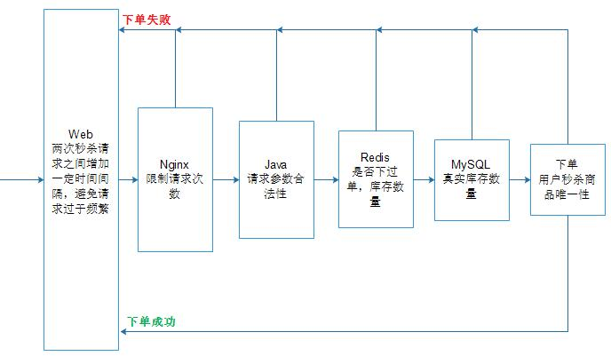

秒杀活动在消费者市场非常流行，用数量有限性价比高的商品吸引众多用户来抢购，既能为少数幸运用户提供实实在在的实惠，也帮助商家进行活动造势、品牌宣传、抢占市场，并且商家投入成本也不算高。但是对于开发者来说，秒杀活动是一场噩梦，相较于正常状态，秒杀活动的巨大短期流量是非正常状态，巨大的流量导致频繁的IO操作，进而引发各种意想不到的问题。
本项目是一个简单Demo后端应用，用于演示如何优雅在后端应付秒杀这种大规模并发场景，只用于演示，不要用于生产环境

## 原理说明
在高并发应用场景下，最容易成为瓶颈是数据库，比如MySQL，如果应用层的请求不经过筛选，直接发送给数据库，请求会积压在数据库，等待前面请求处理完成，对于用户来说，可能需要等上好几分钟才能看到下单结果，从用户体验角度，这是不可接受的。因此，秒杀系统最关键的是将绝大部分请求在应用层处理掉，只有极少数才会落到数据库，进行真正的下单。
- 一个用户只能抢购一件秒杀商品
- 当某个用户请求进入下单流程，其以后的下单请求应该立即返回
- 抢购请求的数量远远大于秒杀商品库存数量，因此99%请求可以在应用层处理掉



## 编译运行
在druid.properties和redis.properties配置好MySQL和Redis连接方式，并且在MySQL执行table.sql
>git clone https://github.com/GongDexing/SecondKill.git<br/>
cd SecondKill<br/>
mvn clean package<br/>
java -jar target/SecondKill-1.0.0.jar<br/>

## 测试
用tbl_goods表中添加一个商品信息，比如iphone 10这个商品，id为1，库存数量为1000，利用apache benchmarking来模拟抢购请求
> ab -n 100000 -c 5000 "http://127.0.0.1:8080/order/1?userId=1&number=1"

```
总共下单数量：1098
总共下单成功数量：1000
```

100000个请求，真正进入下单流程的只有1098，而下单成功的数量就是商品的库存数量，极大减小数据库的压力，有效缩短请求平均处理路径

## Redis设计
### 库存
每个秒杀商品的库存以键值对的形式保存在Redis数据库中<br/>

|序号|模块|key|value|说明|
|:--:|:--:|:--:|:--:|:--|
|1|商品库存|stock:goodsId|number|用于缓存每个商品库存数量，初始库存数量为真实库存数量两倍，库存会根据下单情况实时更新，只有单库存数量大于订单购买数量时，才会对数据库执行下单操作|
|2|已经下单用户|order:userId:goodsId|1或者0|对于进入下单流程的用户，value会被设置为1，如果下单失败，value又会被设置为0|

## 数据表设计
```sql
drop table if exists `tbl_goods`;
CREATE TABLE `tbl_goods` (
  `id` int unsigned NOT NULL AUTO_INCREMENT,
  `name` text COMMENT '商品名称',
  `price` mediumint unsigned DEFAULT 0 COMMENT '商品价格',
  `stock` mediumint unsigned DEFAULT 0 COMMENT '库存数量',
  PRIMARY KEY (`id`)
) ENGINE=InnoDB AUTO_INCREMENT=1 DEFAULT CHARSET=utf8 COMMENT '商品表';

drop table if exists `tbl_user`;
CREATE TABLE `tbl_user` (
  `id` int unsigned NOT NULL AUTO_INCREMENT,
  `username` varchar(10) COMMENT '用户账号',
  `password` varchar(10) COMMENT '用户密码',
  PRIMARY KEY (`id`),
  UNIQUE KEY (`username`)
) ENGINE=InnoDB AUTO_INCREMENT=1 DEFAULT CHARSET=utf8 COMMENT '用户表';

drop table if exists `tbl_order`;
CREATE TABLE `tbl_order` (
  `id` int unsigned NOT NULL AUTO_INCREMENT,
  `userId` int unsigned NOT NULL,
  `goodsId` int unsigned NOT NULL,
  `number` mediumint unsigned COMMENT '购买数量',
  `time` timestamp DEFAULT CURRENT_TIMESTAMP COMMENT '下单时间',
  PRIMARY KEY (`id`),
  UNIQUE KEY (`userId`,`goodsId`)
) ENGINE=InnoDB AUTO_INCREMENT=1 DEFAULT CHARSET=utf8 COMMENT '订单表';
```
